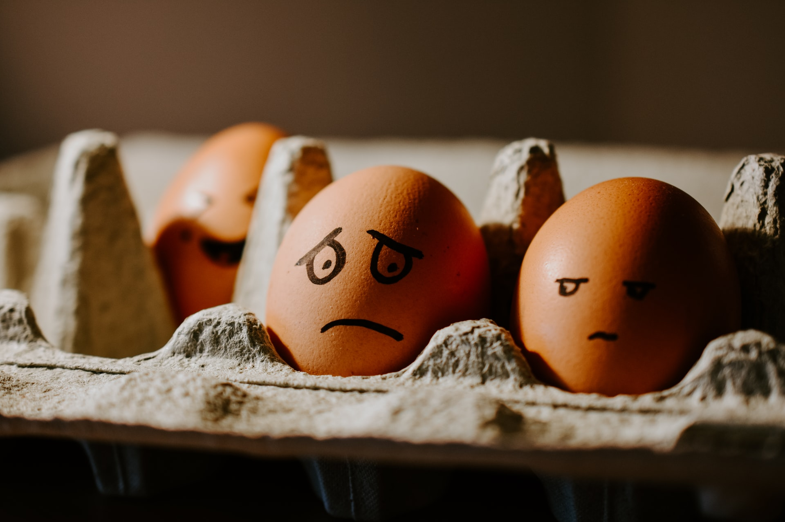

```{r setup, include=FALSE}
knitr::opts_chunk$set(echo = FALSE)
```

```{r, echo = FALSE}

```

Can what we eat really improve our mood?

This is the question that a relatively new field of research is trying to investigate. Nutritional psychiatry tries to understand how overall dietary patterns - as well as specific foods or food groups - influence our overall mental and brain health [@Sarris2019]. And while most of the existing evidence so far is observational - meaning, we cannot draw any causal inferences from their results - there is a consistent trend for healthy diets protecting against the risk of depressive symptoms over time [@Lassale2018]. Unhealthy diets, on the other hand, may *increase* our risk for depression, although the evidence for this is still rather mixed [@Molendijk2018a].

There are also a growing number of randomised controlled trials, which is the strongest form of evidence for cause and effect, showing that adhering to healthy diets can improve symptoms of depression in the general population [@Firth2019a] as well as in individuals with more severe forms of depression [@Jacka2017a]. However, we still have a long way to go before we can definitively prescribe particular diets to people with diagnosed depression. For instance, we are currently still in the process of understanding *how* exactly diet may confer effects on our mental health, which will be the topic of a separate blog post. Associations with anxiety are also much less researched, even though anxiety and depression often co-occur at very high rates!

Understanding what exactly is meant by a healthy diet is also an important factor to consider, as we are often bombarded by lots of information in mainstream media about the latest diet fads, juice cleanses, and detox diets. Which sources are evidence-based and which are just social media hype? If you want to read more about the concept of healthy eating, check out this blog post.

<font size="2">Image credit: Hello I'm Nik on Unsplash</font>
