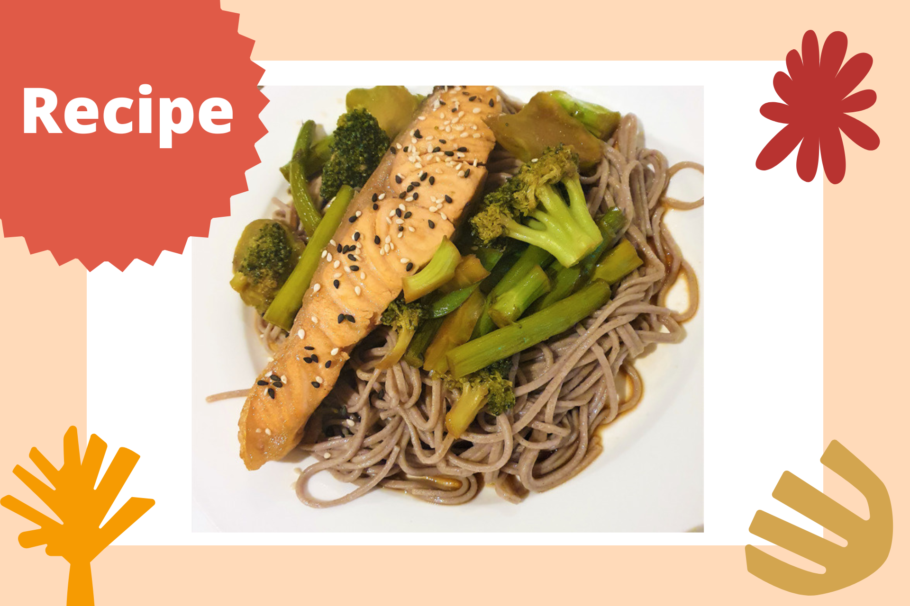

```{r setup, include=FALSE}
knitr::opts_chunk$set(echo = FALSE)
```

```{r, echo = FALSE}

```

This is one of my all time favourite meals that I absolutely devour every time. A very simple, quick, and nutritious lunch or dinner that contains a serving of salmon, buckwheat soba noodles, and plenty of greens!

Salmon is rich in omega-3 fatty acids, protein, and various essential minerals and vitamins that are health-promoting. These omega-3 fats, which we can only get from our diet, have not only been linked to better inflammatory and cardio-metabolic outcomes, but are also increasingly linked to clinical benefits in depression. [@Liao2019;@Grosso2014] And a top tip - if you can leave the salmon skin on, then you'll be getting the [highest concentration of omega-3s!](https://www.healthline.com/health/salmon-skin#health-benefits)

This recipe also includes a variety of veggies - such as broccoli, cauliflower, and asparagus (but these can be substituted for any other veg that you prefer) - which are not only high in dietary fibre and micronutrients, but may also protect against depression. [@Saghafian2018; @Liu2016] You can opt for fresh produce or frozen vegetables - they are both [equally as nutritious](https://www.sciencedirect.com/science/article/pii/S0889157517300418), and frozen veggies are sometimes *even more* nutrient-dense because they are picked at their peak ripeness. It can also help with reducing food wastage and is generally friendlier on the wallet. Win-win!

**Ingredients for two servings:**

* 2 salmon fillets (skin on)
* 180 g buckwheat soba noodles
* 2 cups veggies of choice: broccoli, cauliflower, asparagus, etc. (fresh or frozen)
* Homemade teriyaki sauce (following [this](https://www.youtube.com/watch?v=XKN9y5i7ZP8) recipe - it only takes 5 minutes!)
* Corn flour 
* Olive oil 
* Sesame seeds to garnish (optional)

**Steps:**

1. Prepare the teriyaki sauce as outlined above (or, if you prefer, you can of course purchase a ready-made bottled version - but I would recommend looking at the amount of salt/sugar in some of these, they can sometimes be exceedingly high!).
2. Meanwhile, dust the salmon fillets with a light layer of corn flour on all sides.
3. Pre-heat a shallow frying pan with a few table spoons of oil over a medium heat, and pan fry salmon fillets on each side for 2-3 minutes depending on how well done you like your salmon. Set aside once cooked to your liking.
4. Prepare a pot of water and gently bring up to the boil. 
5. Prepare your veggies - if using fresh produce, I like to cut the veggies into bite-size pieces and either steam or gently fry on a low heat. If frozen, I either defrost the veggies in the microwave or heat them up on the pan in some of the teriyaki sauce (read on for this step).
6. While the veggies are being cooked, prepare the soda noodles in the large pot of boiling water (no need to add extra salt to the water, as the soda noodles are already salted) as per packet instructions. Drain and rinse in some cold water once cooked so that the noodles don't stick together. Set aside.
7. Heat up about 3/4 cup of the terikyaki sauce in a shallow pan and place the salmon fillets in the sauce so that they are evenly coated. During this step, I also like to add the frozen vegetables so that they heat up at the same time and are coated in the teriyaki sauce.
8. Once the veggies are done, plate everything up - one piece of salmon, a serving of soba noodles and veggies, and a light drizzle of the teriyaki sauce over the noodles.
9. Sprinkle with some sesame seeds and enjoy!

