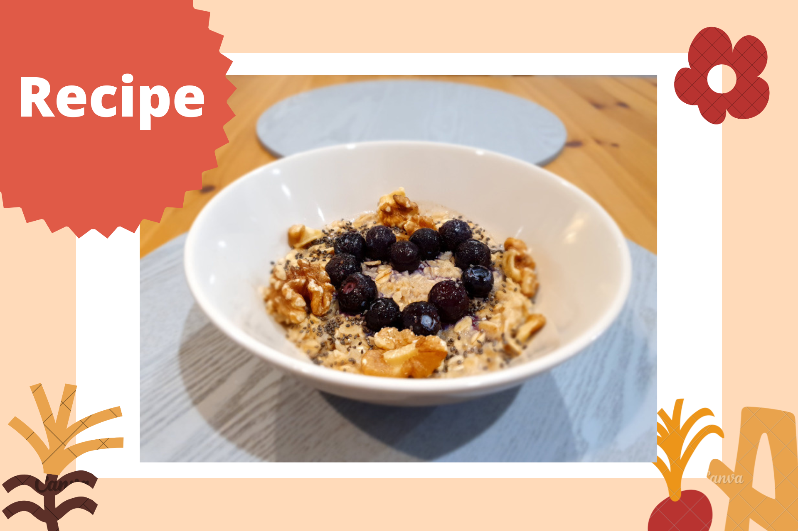

```{r setup, include=FALSE}
knitr::opts_chunk$set(echo = FALSE)
```

```{r, echo = FALSE}

```

In need of a quick, easy, and healthy breakfast option? Look no further!

This delicious, nutrient-dense, and budget-friendly meal is how I start every single day. It helps to keep me full and gives me a slow but steady release of energy throughout the morning. Oats are a great source of dietary fibres and other bioactive compounds that have been linked to [numerous health benefits](https://academic.oup.com/nutritionreviews/article/78/Supplement_1/13/5877748?login=false), such as lowering cholesterol and reducing the blood glucose response after eating. Also, the soluble fibre in oats (called beta-glucans) have prebiotic effects, which means they help to feed the beneficial microbes in the gut.

The blueberries in this recipe pack a further punch with their beneficial [phytochemical properties](https://academic.oup.com/advances/article/11/2/224/5536953?login=false) and heavy anti-oxidant and anti-inflammatory benefits. Finally, the walnuts and chia seeds are rich in omega-3 fatty acids (among other minerals and fibres) which are involved in a wide range of important processes related to the [growth and functioning of our brain](https://www.sciencedirect.com/science/article/pii/S241464472030004X), as well as to maintain healthy cognition and mood. So, there's no reason not to tuck in!

**Ingredients:**

* 1/4 cup rolled oats
* 1/4 cup quick oats
* 1/4 tsp ground cinnamon
* 1/4 cup frozen (or fresh) blueberries
* 3/4 cup milk of choice (e.g., dairy, soy, oat milk)
* 1/2 tsp chia seeds
* Handful of walnuts 

**Steps:**

1. Combine the rolled oats, quick oats, blueberries (if frozen), and cinnamon in a microwave safe bowl
2. Add the milk and stir in well
3. Microwave on a high setting (800-1000W) for 1.5 - 2 minutes
4. Stir well and sprinkle on chia seeds and walnuts on top (and if using fresh blueberries, add at this point)  
5. Enjoy!

*Note. If you like your porridge to be a bit sweeter, add in a sweetener of choice, like a drizzle of honey or sprinkle of stevia. Also feel free to swap out the blueberries for another berry or fruit to keep it interesting!* 
