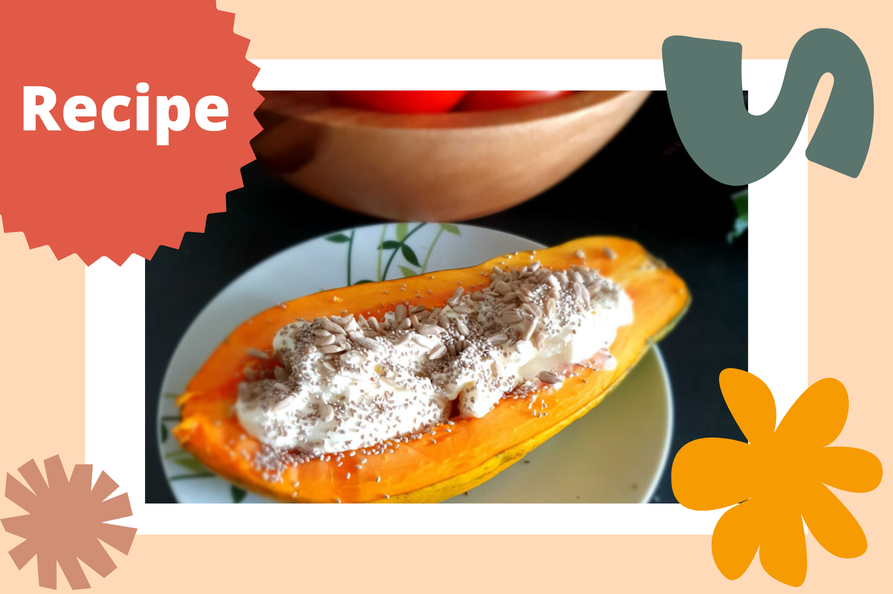

```{r setup, include=FALSE}
knitr::opts_chunk$set(echo = FALSE)
```

```{r, echo = FALSE}

```

Here's another really quick and easy breakfast idea - perfect for the warm summer months ahead in the southern hemisphere! Papaya is one of my favourite tropical fruits - not only is it delicious, but it packs a heavy punch in terms of its nutritional properties! Rich in vitamins A, C, and E, and a number of beneficial phytochemicals (chemical compounds produced by plants)[@Ikram2015], papaya consumption has been linked to various health benefits, including digestive and immune modulation. [@Heena2019]

Speaking of digestion - some types of yogurt containing live, active cultures may be beneficial for your gut health! Research has shown that regular consumption of yogurt and other fermented foods containing beneficial strains, such as *Bifidobacteria* and *Lactobacillus*, is associated with improved intestinal and extraintestinal health [@Kok2018]. Yogurt is also rich in calcium, various B vitamins, and other trace minerals that are important for health - just beware of yogurts that are laden with too much sugar!

Lastly, adding a handful of nuts and seeds on your papaya bowl will add a generous serving of protein, healthy fats, fibre, and beneficial micronutrients. Nuts and seeds also help to keep us fuller for longer - meaning that they can help with [weight regulation and protect against various chronic diseases.](https://www.betterhealth.vic.gov.au/health/healthyliving/nuts-and-seeds)


**Ingredients for one serving:**

* Half a ripe papaya
* 3/4 cup of natural yogurt
* Handful of nuts (e.g. walnuts, almonds, macadamias) and seeds (e.g. chia, flax seeds, or pumpkin seeds) - experiment with this and diversify! The more variety, the better! :) 

**Steps:**

1. Cut the papaya in half (length wise) and scoop out the seeds if you wish (technically, the seeds are edible and have even been linked to some [health benefits](https://www.phytojournal.com/archives?year=2017&vol=6&issue=1&ArticleId=1110) - but they are bitter)
2. Spoon the yogurt into the papaya and sprinkle with your selection of nuts and seeds
3. Optional - add a drizzle of honey or your choice of sweetener if you have a bit of a sweet tooth (like me)
4. Dig in!