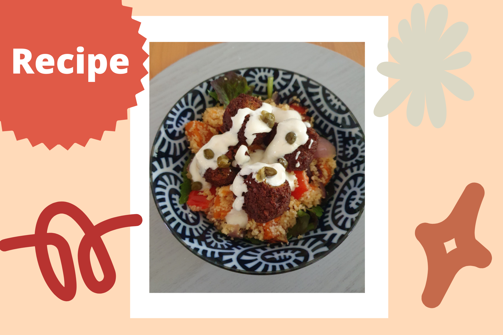

```{r setup, include=FALSE}
knitr::opts_chunk$set(echo = FALSE)
```

```{r, echo = FALSE}

```

Another quick and easy healthy lunch idea for you! This recipe was actually inspired from a meal kit card that I had some time ago - but I modified it to make it my own. This version packs even more veggies and flavours and has been a staple go-to-lunch for me, especially in the warmer months.

Falafel is a popular Middle Eastern dish made of spiced mashed chickpeas or other pulses that are formed into balls or fritters and usually deep fried - although I personally prefer to bake or airfry my falafel which is not only [healthier](https://www.mdpi.com/2304-8158/10/11/2567) but still achieves that same delicious crispiness. Falafel is high in [dietary fibre and plant-based protein](https://www.scirp.org/journal/paperinformation.aspx?paperid=80589) and contains other beneficial minerals such as phosphorus, potassium, calcium, magnesium, zinc, and iron - making it a fast-food that packs a punch above the rest!

**Ingredients for four servings:**

* 1 packet of ready-to-eat falafel 
* 100 g couscous
* 1 red onion, 1 red capsicum, 1 sweet potato (but feel free to mix up these veggies with pumpkin, zucchini, eggplant, etc. and adjust roasting time as needed)
* Mixed leaves (spinach, rocket, etc.)
* Olive oil 
* Lemon juice
* Greek yogurt
* Salt and pepper
* Capers (optional)

**Steps:**

1. Pre-heat oven (fan forced) to 180 degrees Celsius.
2. Meanwhile, cut up the onion, capsicum, and sweet potato into small bite-size pieces, place onto a baking tray, and toss together with a drizzle of olive oil and salt/pepper.
3. Once the oven is pre-heated, roast veggies for about 20 minutes or until they can be easily skewered with a fork.
4. Place falafel onto another baking tray and place into the oven for about 10 minutes (alternatively, place into an air fryer instead)
5. While the veggies/falafel are roasting away, place couscous into a small pot and add 150 mL of boiling water, combining well, and then let it rest for about 5 minutes with the cover on. After 5 minutes, fluff up with a fork and add a bit of olive oil to taste. Set aside.
6. Once the vegetables and falafel are ready, toss veggies into the pot of couscous and combine well, adding a dash of lemon juice and some salt/pepper. 
7. In a big bowl, lay down a layer of mixed leaves and spoon on a quarter of the couscous mixture. Place 3-4 falafel on top, drizzle over some greek yogurt, and sprinkle with some capers for garnish. I also sometimes like to add a dollop of hummus at the end for some extra creaminess and flavour - it goes really well together~
8. Mix well and enjoy!

